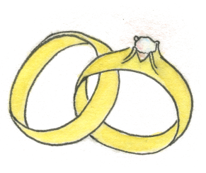

<a href="/english.html">English</a>

{::options parse_block_html="true" /}

### Vi ska gifta oss!

Välkommen på vårt bröllop!

Här på hemsidan kan du nu anmäla dig till bröllopet
och snart kommer det även dyka upp fler spännande
saker och viktig info kring bröllopet,
så missa inte att komma tillbaka snart igen.

### Viktig uppdatering om bröllopet
 
Vi har inväntat besked kring restriktioner och igår kom beskedet att restriktioner kring privat fest kommer att tas bort först den 29 september.
Just nu gäller för privat fest att man får vara 50 personer per lokal eller utrymme, till detta räknas även tält. Detta innebär att bröllopsmiddagen inte kommer kunna hållas i ladan som det först var tänkt. Vi har därför landat i lösningen att ha middagen i tält med plats för max 50 personer per tält. Detta innebär att vi kommer att resa 4 tält på grönområdet utanför ladan och duka för middagen i dessa. Vi ser till att det finns uppvärmning i tältet utfall att det skulle bli kallare väder men det kan även vara bra att ha med sitt lite varmare kläder för att vara på den säkra sidan, särskilt om man vet med sig att man lättare blir frusen. Festen kommer i och med att vi flyttat till tält att bli lite kortare än vi tidigare tänkt, vi avrundar kvällen runt klockan 21, senast 21:30. Vigseln och fikat efteråt kommer att hållas som vi planerat för sedan tidigare. Vi hoppas ni förstår att vi landat i detta beslut eftersom vi vill att ni alla ska kunna vara med på bröllopsfesten och detta är ett sätt att möjliggöra detta och samtidigt hålla oss till de restriktioner som gäller just nu. På bröllopet kommer det även att informeras om hur vi genomför bröllopsdagen på ett så säkert och ansvarsfullt sätt som vi kan.
 
Vi ser så mycket fram emot att se er på Näs Herrgård den 18 september!
Kramar från Victoria och Mikael
 
### Vår story
Vår gemensamma resa började i slutet på 2018 när vi samåkte till Norge för
att båda medverka i TV. Vi kände inte varandra sen innan men våra samtal
flöt på och det blev ganska tydligt att vi blev inspirerande av att prata med
varandra. Dagarna i tv-studion var intensiva så det var inte förens på
hemresan som samtalen djupnade och vi kunde se mer av varandra. Det
blev klart för oss båda att vi hade en gemensam längtan. Vi längtade efter
mer av Jesu närvaro och att se Honom för den Han verkligen är. Denna
längtan ledde oss närmre varandra och vi började ta upp mer kontakt med
varandra, en kontakt som växte sig starkare framåt våren. Sommaren gick
och längtan efter varandra växte. Funderingar kring att våga öppna våra
hjärtan kom ikapp oss och den 13 oktober blev vi tillsammans. Den 19 juli
förra året gick Mikael ner på knä vid Korset i Hassela och Victoria sa ja. Nu
längtar vi efter att bli man och hustru.

Victoria & Mikael

<iframe width="100%" src="https://www.youtube.com/embed/pqWiHZLRWGg" title="YouTube video player" frameborder="0" allow="accelerometer; autoplay; clipboard-write; encrypted-media; gyroscope; picture-in-picture" allowfullscreen></iframe>

### Plats

Vigsel och fest är på Näs Herrgård i Mullsjö.

<iframe src="https://www.google.com/maps/embed?pb=!1m18!1m12!1m3!1d2688.967822294081!2d13.777206716154385!3d57.86186353483952!2m3!1f0!2f0!3f0!3m2!1i1024!2i768!4f13.1!3m3!1m2!1s0x465a625cc797b385%3A0x8d9c1c9619b06de5!2zTsOkcyBIZXJyZ8OlcmQ!5e1!3m2!1sen!2sse!4v1621153274421!5m2!1sen!2sse" width="100%" height="450" style="border:0;" allowfullscreen="" loading="lazy"></iframe>

### Önskelista

Vi har en [önskelista](https://onskelista.se/w/brollopsgavor-3) där vi kommer fylla på
mer efterhand.

### Klädkod - Kavaj
För herrar innebär kavaj att man bär
- Kostym i valfri färg
- Skjorta i valfri färg
- Skor i valfri färg
- Matchande slips eller fluga

För damer innebär kavaj att man bär
- En finare klänning än till vardags i valfri färg som kan vara allt ifrån
mididress till maxidress.

Eller

- Kjol och kavaj

Förslag på tillbehör är
- Sjal
- Smycken
- Handväska
- Finskor

### Övernattning
För gäster som är i behov av övernattning är ett både smidigt och prisvärt
alternativ att bo på Nyhemsgården. Den ligger ca 8 minuter bort med bil och
de tar SEK 210 per natt och säng. Täcke och kudde finns på plats, man tar
med egna lakan.

Om ni är intresserad av att bo på Nyhem behöver ni höra av er till Mikael
Swetzén den 12 augusti på telefon 0733-499328.

{:.image.image--xs}

<iframe src="https://docs.google.com/forms/d/e/1FAIpQLSf0wLtFi7x7YhXe-9HKLjOeRbAcSOxcwI44sbk5fNmTclgzaw/viewform?embedded=true" width="100%" height="500" frameborder="0" marginheight="0" marginwidth="0">Loading…</iframe>

{:.image.image--xs}

Vi vet att för dem som älskar Gud samverkar allt till det bästa, för dem som är kallade efter hans beslut.
